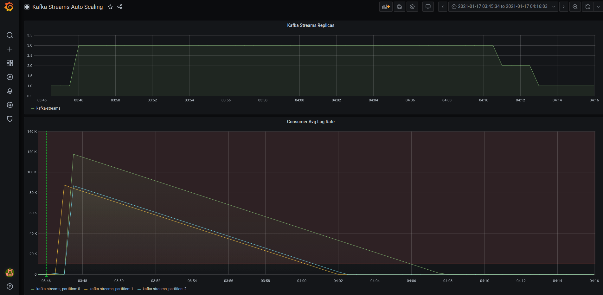

# Autoscaling Kafka Streams applications with Prometheus and Kubernetes
Detailed explanation what this repo is about is available at [post](https://blog.softwaremill.com/autoscaling-kafka-streams-applications-with-kubernetes-9aed2e37d3a0).

## Requirements
1. Kubernetes cluster. You can install [minikube](https://kubernetes.io/docs/tasks/tools/install-minikube/) locally.
2. [Helm](https://helm.sh/docs/intro/install/) version 3+.

## PreInstall
Install external helm repositories [bitnami](https://charts.bitnami.com/bitnami) & [prometheus-community](https://prometheus-community.github.io/helm-charts)

``` helm repo add bitnami https://charts.bitnami.com/bitnami ```

``` helm repo add prometheus-community https://prometheus-community.github.io/helm-charts ```

``` helm repo update ```

## TL;DR

``` APP_HOME=<absolute_path_to_application> ```

``` mkdir --parents $APP_HOME && cd $APP_HOME ``` then download [default deployment helm configuration](https://github.com/DmitryAEfimov/kafka-streams-scaling/tree/main/k8s) to it

``` minikube start [<...you minikube config here...>] ```

``` kubectl create namespace kafka ```

``` kubectl config set-context --current --namespace kafka ```

### Install or Update prometheus-stack
``` cd $APP_HOME/k8s/prometheus-stack && ./install.sh ```

### Install or Update kafka-streams
Check [dependencies](https://github.com/DmitryAEfimov/kafka-streams-scaling/blob/main/k8s/kafka-streams/Chart.yaml) actual version ``` helm search repo | grep '<repo_name>/<chart_name>' ```. 

Update versions if needed:
* Edit version numbers in ``` $APP_HOME/k8s/kafka-streams/Chart.yaml ```
* ``` cd $APP_HOME/k8s/kafka-streams/charts && helm pull <repo_name>/<chart_name> ```

``` cd $APP_HOME/k8s/kafka-streams && ./install.sh ```

### Check results
You can use ``` watch kubectl get all ``` command to watch pods state

Forward grafana service TCP port to localhost ``` kubectl port-forward service/prometheus-stack-grafana <localhost_tcp_port>:80 ```.

Open grafana dashboards in browser ``` http://localhost:<localhost_tcp_port> ``` and login with default credentials ``` admin/prom-operator ```

Select dashboard named ``` Kafka Streams Auto Scaling ```

See similar 

### Stop containers
``` cd $APP_HOME/k8s/kafka-streams && ./delete.sh ```

``` cd $APP_HOME/k8s/prometheus-stack && ./delete.sh ```